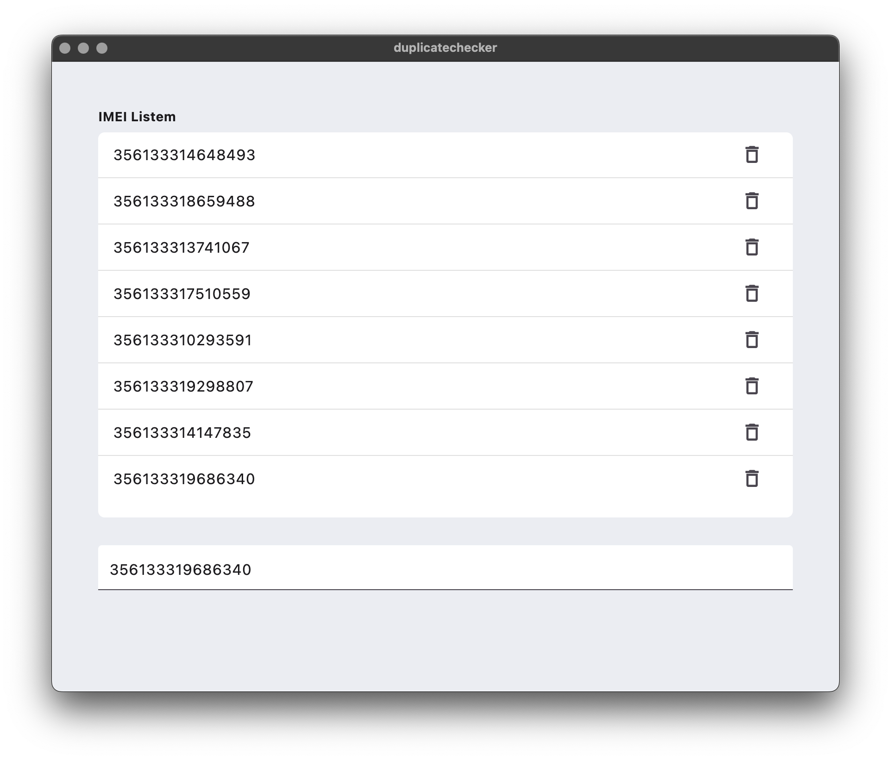

### A simple text saver and duplicate preventer
when user types and presses enter key on keyboard it checks if the textfield value is saved already
 - if found it wont add and shows error message
 - if not found saves it to local db (hive)

